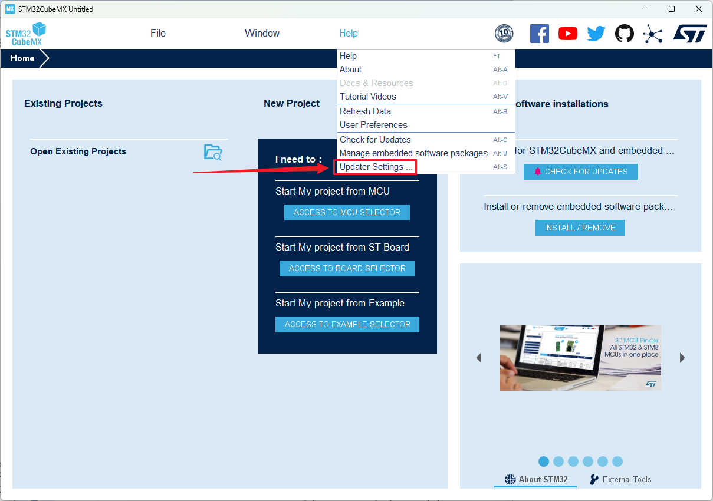
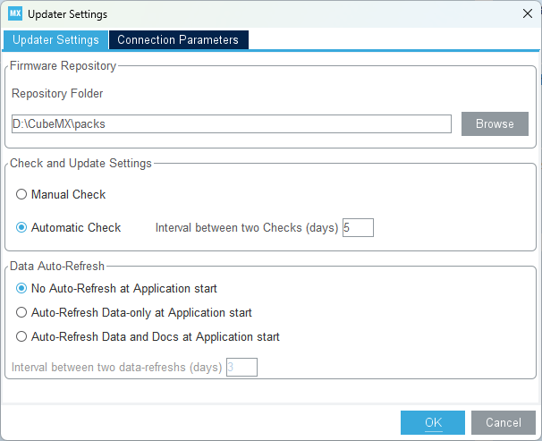
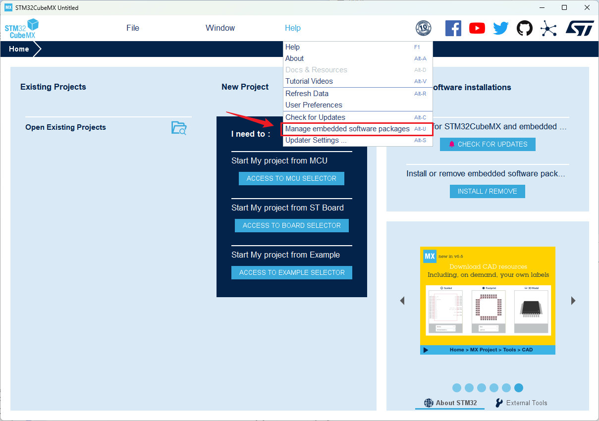
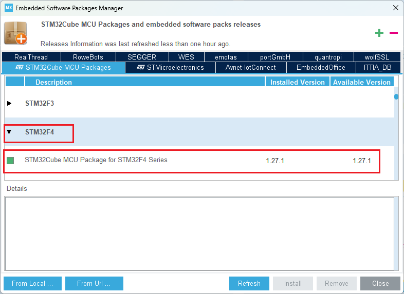
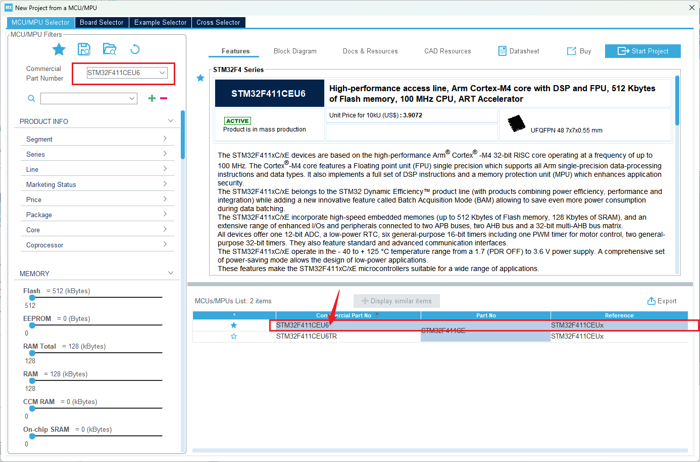
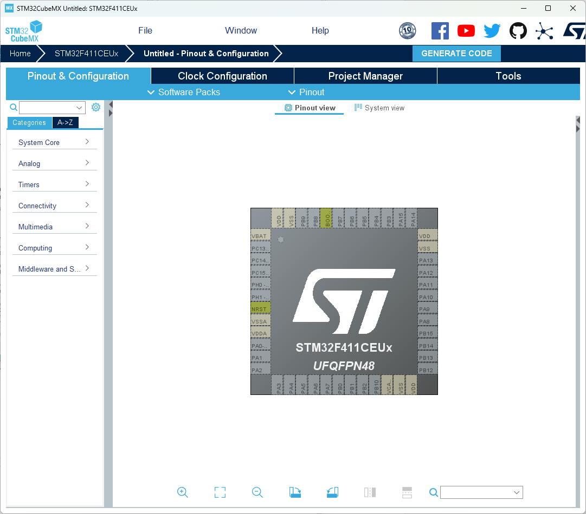

## 软件设置

下载安装软件之后，需要下载芯片对应的资料

1. 首先设置下载文件存储位置

2. 进入之后，选择一个路径，然后点击ok，其它自动更新等设置按给出图片中的选项来。

3. 然后再点击help进入Manage embeded software packages选项中

4. 找到对应的系列，选择并下载就可以了，注意尽量不要点击refresh，会耗费很长时间，然后点击close即可

​	

## 新建一个工程

在project中选择new project

然后就进入了芯片配置页面

