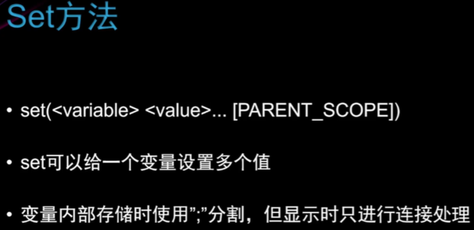
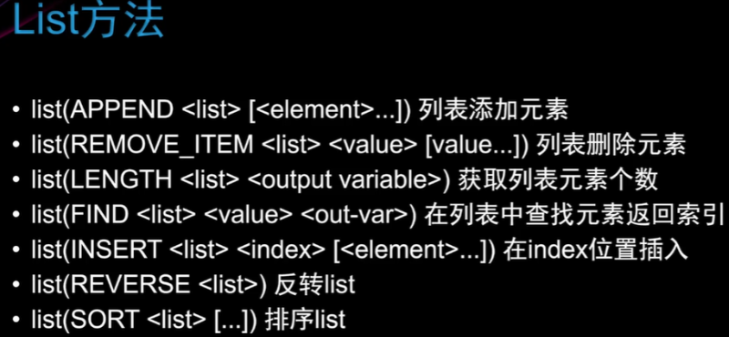
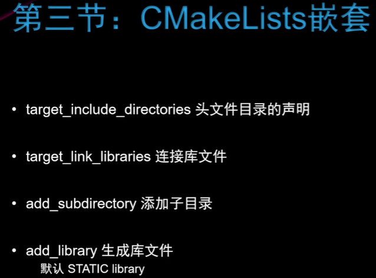

## LINUX安装

ubuntu安装命令：`sudo apt install cmake`不过这样可能安装的版本很老

### 源码安装

首先下载源文件https://cmake.org/download/；然后解压缩：`tar -zxvf cmake-3.24.1.tar.gz`

进入解压后的文件夹，执行`bootstrap`文件进行检查，可能会出现各种报错，百度解决；当出现：

`CMake has bootstrapped.  Now run gmake.`时进行下一步：

按照输出的提示，输入以下命令进行编译构建：

``` shell
make
```

当提示以下内容时，进入下一步：

``` shell
[100%] Built target foo
```

输入以下命令执行安装

``` shell
sudo make install
```

### 检验安装是否成功

输入命令：

``` shell
cmake --version
```

看看是否有CMake版本信息输出，如下所示：

``` shell
cmake version 3.16.0-rc3
CMake suite maintained and supported by Kitware (kitware.com/cmake).
```

成功安装cmake后，如果出现`-bash: /usr/bin/cmake: No such file or directory`，则可以手动添加，找到安装的cmake文件，进入cmake3.x文件夹中，在进入bin文件夹，运行`sudo cp ./cmake-3.x/bin/cmake /usr/bin/`

即可解决。

自此，CMake源码编译安装完成

## 语法

### message

打印信息；创建以`.cmake`为后缀的文件；执行：`cmake -P first.cmake`，first.cmake为我的演示文件

- 单行打印
- 多行打印（注意下方多行打印的区别）

``` cmake
cmake_minimum_required(VERSION 3.20)

message("----message function demo------")
message("hello")
message(hello)
message("hel
         llo")
message("hel
llo")
message([[hel
          llo]])
message([[hel
llo]])
message("----message function demo finish------")
```

输出：注意这几个多行打印的不同

``` shell
xiaowu@DESKTOP-FE78O6H:~/smart_speaker$ cmake -P first.cmake 
----message function demo------
hello
hello
hel
         llo
hel
llo
hel
          llo
hel
llo
----message function demo finish------
```

### set



- 单个变量的设置方法，注意变量名称带有空格的情况，第5行
- 变量赋多值的方法
- 打印环境变量的方法
- 设置环境变量的方法

``` cmake
message("----get information from cmake demo-------")
set(Var1 YZZY)
message(${Var1})

set("My Var" zzz)
message(${My\ Var}) # notice the space, Need to add translation characters \

set([[My Var2]] xxx)
message(${My\ Var2})

# set multiple values
set(LISTVALUE a1 a2)
message(${LISTVALUE})
set(LISTVALUE a1;a2)
message(${LISTVALUE})

# print envoronment variables
message($ENV{PATH})
set(ENV{CXX} "g++")
message($ENV{CXX})
```

输出：

``` shell
----get information from cmake demo-------
YZZY
zzz
xxx
a1a2
a1a2
# 这里省略了环境变量PATH中的内容，打印出来太多了
g++
```

### list



## cmake构建项目

