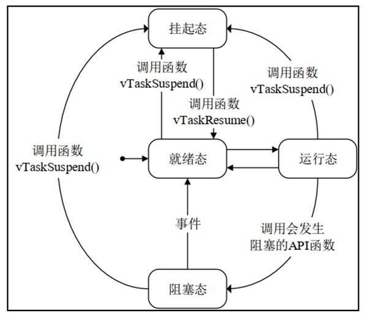

## 说明

本文档主要参考正点原子的公开教程，以及FreeRTOS源码

## FreeRTOS配置文件详解

相关的宏大致可以分为三类

`INCLUDE`：配置FreeRTOS中可选的API函数

`config`：完成FreeRTOS的功能配置和裁剪

其它配置项：`PendSV宏定义、SVC宏定义`

正点原子提供的配置文件示例：

``` c
extern uint32_t SystemCoreClock;

/* 基础配置项 */
#define configUSE_PREEMPTION                            1                       /* 1: 抢占式调度器, 0: 协程式调度器, 无默认需定义 */
#define configUSE_PORT_OPTIMISED_TASK_SELECTION         1                       /* 1: 使用硬件计算下一个要运行的任务, 0: 使用软件算法计算下一个要运行的任务, 默认: 0 */
#define configUSE_TICKLESS_IDLE                         0                       /* 1: 使能tickless低功耗模式, 默认: 0 */
#define configCPU_CLOCK_HZ                              SystemCoreClock         /* 定义CPU主频, 单位: Hz, 无默认需定义 */
//#define configSYSTICK_CLOCK_HZ                          (configCPU_CLOCK_HZ / 8)/* 定义SysTick时钟频率，当SysTick时钟频率与内核时钟频率不同时才可以定义, 单位: Hz, 默认: 不定义 */
#define configTICK_RATE_HZ                              1000                    /* 定义系统时钟节拍频率, 单位: Hz, 无默认需定义 */
#define configMAX_PRIORITIES                            32                      /* 定义最大优先级数, 最大优先级=configMAX_PRIORITIES-1, 无默认需定义 */
#define configMINIMAL_STACK_SIZE                        128                     /* 定义空闲任务的栈空间大小, 单位: Word, 无默认需定义 */
#define configMAX_TASK_NAME_LEN                         16                      /* 定义任务名最大字符数, 默认: 16 */
#define configUSE_16_BIT_TICKS                          0                       /* 1: 定义系统时钟节拍计数器的数据类型为16位无符号数, 无默认需定义 */
#define configIDLE_SHOULD_YIELD                         1                       /* 1: 使能在抢占式调度下,同优先级的任务能抢占空闲任务, 默认: 1 */
#define configUSE_TASK_NOTIFICATIONS                    1                       /* 1: 使能任务间直接的消息传递,包括信号量、事件标志组和消息邮箱, 默认: 1 */
#define configTASK_NOTIFICATION_ARRAY_ENTRIES           1                       /* 定义任务通知数组的大小, 默认: 1 */
#define configUSE_MUTEXES                               1                       /* 1: 使能互斥信号量, 默认: 0 */
#define configUSE_RECURSIVE_MUTEXES                     1                       /* 1: 使能递归互斥信号量, 默认: 0 */
#define configUSE_COUNTING_SEMAPHORES                   1                       /* 1: 使能计数信号量, 默认: 0 */
#define configUSE_ALTERNATIVE_API                       0                       /* 已弃用!!! */
#define configQUEUE_REGISTRY_SIZE                       8                       /* 定义可以注册的信号量和消息队列的个数, 默认: 0 */
#define configUSE_QUEUE_SETS                            1                       /* 1: 使能队列集, 默认: 0 */
#define configUSE_TIME_SLICING                          1                       /* 1: 使能时间片调度, 默认: 1 */
#define configUSE_NEWLIB_REENTRANT                      0                       /* 1: 任务创建时分配Newlib的重入结构体, 默认: 0 */
#define configENABLE_BACKWARD_COMPATIBILITY             0                       /* 1: 使能兼容老版本, 默认: 1 */
#define configNUM_THREAD_LOCAL_STORAGE_POINTERS         0                       /* 定义线程本地存储指针的个数, 默认: 0 */
#define configSTACK_DEPTH_TYPE                          uint16_t                /* 定义任务堆栈深度的数据类型, 默认: uint16_t */
#define configMESSAGE_BUFFER_LENGTH_TYPE                size_t                  /* 定义消息缓冲区中消息长度的数据类型, 默认: size_t */

/* 内存分配相关定义 */
#define configSUPPORT_STATIC_ALLOCATION                 0                       /* 1: 支持静态申请内存, 默认: 0 */
#define configSUPPORT_DYNAMIC_ALLOCATION                1                       /* 1: 支持动态申请内存, 默认: 1 */
#define configTOTAL_HEAP_SIZE                           ((size_t)(10 * 1024))   /* FreeRTOS堆中可用的RAM总量, 单位: Byte, 无默认需定义 */
#define configAPPLICATION_ALLOCATED_HEAP                0                       /* 1: 用户手动分配FreeRTOS内存堆(ucHeap), 默认: 0 */
#define configSTACK_ALLOCATION_FROM_SEPARATE_HEAP       0                       /* 1: 用户自行实现任务创建时使用的内存申请与释放函数, 默认: 0 */

/* 钩子函数相关定义 */
#define configUSE_IDLE_HOOK                             0                       /* 1: 使能空闲任务钩子函数, 无默认需定义  */
#define configUSE_TICK_HOOK                             0                       /* 1: 使能系统时钟节拍中断钩子函数, 无默认需定义 */
#define configCHECK_FOR_STACK_OVERFLOW                  0                       /* 1: 使能栈溢出检测方法1, 2: 使能栈溢出检测方法2, 默认: 0 */
#define configUSE_MALLOC_FAILED_HOOK                    0                       /* 1: 使能动态内存申请失败钩子函数, 默认: 0 */
#define configUSE_DAEMON_TASK_STARTUP_HOOK              0                       /* 1: 使能定时器服务任务首次执行前的钩子函数, 默认: 0 */

/* 运行时间和任务状态统计相关定义 */
#define configGENERATE_RUN_TIME_STATS                   0                       /* 1: 使能任务运行时间统计功能, 默认: 0 */
#if configGENERATE_RUN_TIME_STATS
#include "./BSP/TIMER/btim.h"
#define portCONFIGURE_TIMER_FOR_RUN_TIME_STATS()        ConfigureTimeForRunTimeStats()
extern uint32_t FreeRTOSRunTimeTicks;
#define portGET_RUN_TIME_COUNTER_VALUE()                FreeRTOSRunTimeTicks
#endif
#define configUSE_TRACE_FACILITY                        1                       /* 1: 使能可视化跟踪调试, 默认: 0 */
#define configUSE_STATS_FORMATTING_FUNCTIONS            1                       /* 1: configUSE_TRACE_FACILITY为1时，会编译vTaskList()和vTaskGetRunTimeStats()函数, 默认: 0 */

/* 协程相关定义 */
#define configUSE_CO_ROUTINES                           0                       /* 1: 启用协程, 默认: 0 */
#define configMAX_CO_ROUTINE_PRIORITIES                 2                       /* 定义协程的最大优先级, 最大优先级=configMAX_CO_ROUTINE_PRIORITIES-1, 无默认configUSE_CO_ROUTINES为1时需定义 */

/* 软件定时器相关定义 */
#define configUSE_TIMERS                                1                               /* 1: 使能软件定时器, 默认: 0 */
#define configTIMER_TASK_PRIORITY                       ( configMAX_PRIORITIES - 1 )    /* 定义软件定时器任务的优先级, 无默认configUSE_TIMERS为1时需定义 */
#define configTIMER_QUEUE_LENGTH                        5                               /* 定义软件定时器命令队列的长度, 无默认configUSE_TIMERS为1时需定义 */
#define configTIMER_TASK_STACK_DEPTH                    ( configMINIMAL_STACK_SIZE * 2) /* 定义软件定时器任务的栈空间大小, 无默认configUSE_TIMERS为1时需定义 */

/* 可选函数, 1: 使能 */
#define INCLUDE_vTaskPrioritySet                        1                       /* 设置任务优先级 */
#define INCLUDE_uxTaskPriorityGet                       1                       /* 获取任务优先级 */
#define INCLUDE_vTaskDelete                             1                       /* 删除任务 */
#define INCLUDE_vTaskSuspend                            1                       /* 挂起任务 */
#define INCLUDE_xResumeFromISR                          1                       /* 恢复在中断中挂起的任务 */
#define INCLUDE_vTaskDelayUntil                         1                       /* 任务绝对延时 */
#define INCLUDE_vTaskDelay                              1                       /* 任务延时 */
#define INCLUDE_xTaskGetSchedulerState                  1                       /* 获取任务调度器状态 */
#define INCLUDE_xTaskGetCurrentTaskHandle               1                       /* 获取当前任务的任务句柄 */
#define INCLUDE_uxTaskGetStackHighWaterMark             1                       /* 获取任务堆栈历史剩余最小值 */
#define INCLUDE_xTaskGetIdleTaskHandle                  1                       /* 获取空闲任务的任务句柄 */
#define INCLUDE_eTaskGetState                           1                       /* 获取任务状态 */
#define INCLUDE_xEventGroupSetBitFromISR                1                       /* 在中断中设置事件标志位 */
#define INCLUDE_xTimerPendFunctionCall                  1                       /* 将函数的执行挂到定时器服务任务 */
#define INCLUDE_xTaskAbortDelay                         1                       /* 中断任务延时 */
#define INCLUDE_xTaskGetHandle                          1                       /* 通过任务名获取任务句柄 */
#define INCLUDE_xTaskResumeFromISR                      1                       /* 恢复在中断中挂起的任务 */

/* 中断嵌套行为配置 */
#ifdef __NVIC_PRIO_BITS
    #define configPRIO_BITS __NVIC_PRIO_BITS
#else
    #define configPRIO_BITS 4
#endif

#define configLIBRARY_LOWEST_INTERRUPT_PRIORITY         15                  /* 中断最低优先级 */
#define configLIBRARY_MAX_SYSCALL_INTERRUPT_PRIORITY    5                   /* FreeRTOS可管理的最高中断优先级 */
#define configKERNEL_INTERRUPT_PRIORITY                 ( configLIBRARY_LOWEST_INTERRUPT_PRIORITY << (8 - configPRIO_BITS) )
#define configMAX_SYSCALL_INTERRUPT_PRIORITY            ( configLIBRARY_MAX_SYSCALL_INTERRUPT_PRIORITY << (8 - configPRIO_BITS) )
#define configMAX_API_CALL_INTERRUPT_PRIORITY           configMAX_SYSCALL_INTERRUPT_PRIORITY

/* FreeRTOS中断服务函数相关定义 */
#define xPortPendSVHandler                              PendSV_Handler
#define vPortSVCHandler                                 SVC_Handler

/* 断言 */
#define vAssertCalled(char, int) printf("Error: %s, %d\r\n", char, int)
#define configASSERT( x ) if( ( x ) == 0 ) vAssertCalled( __FILE__, __LINE__ )
```

## 基本变量类型

```c
/* Type definitions. */
#define portCHAR		char
#define portFLOAT		float
#define portDOUBLE		double
#define portLONG		long
#define portSHORT		short
#define portSTACK_TYPE	uint32_t
#define portBASE_TYPE	long

typedef portSTACK_TYPE StackType_t;
typedef long BaseType_t;
typedef unsigned long UBaseType_t;


#if( configUSE_16_BIT_TICKS == 1 )
	typedef uint16_t TickType_t;
	#define portMAX_DELAY ( TickType_t ) 0xffff
#else
	typedef uint32_t TickType_t;
	#define portMAX_DELAY ( TickType_t ) 0xffffffffUL
#endif


#define pdFALSE                                  ( ( BaseType_t ) 0 )
#define pdTRUE                                   ( ( BaseType_t ) 1 )

#define pdPASS                                   ( pdTRUE )
#define pdFAIL                                   ( pdFALSE )
#define errQUEUE_EMPTY                           ( ( BaseType_t ) 0 )
#define errQUEUE_FULL                            ( ( BaseType_t ) 0 )

/* FreeRTOS error definitions. */
#define errCOULD_NOT_ALLOCATE_REQUIRED_MEMORY    ( -1 )
#define errQUEUE_BLOCKED                         ( -4 )
#define errQUEUE_YIELD                           ( -5 )
```

## 任务创建和删除

### 总述：任务创建和删除相关API函数

`xTaskCreate()`-动态方式创建任务：任务的任务控制块以及任务的栈空间所需的内存，均由 FreeRTOS 从 FreeRTOS 管理的堆中分配 ；

`xTaskCreateStatic()`-静态方式创建任务：任务的任务控制块以及任务的栈空间所需的内存，需用户分配提供；

`vTaskDelete()`-删除任务：

### 动态创建任务

#### 函数签名

```c
BaseType_t xTaskCreate ( 	
    TaskFunction_t 						pxTaskCode,		/* 指向任务函数的指针 */				
 	const char * const 					pcName, 		/* 任务名字，最大长度configMAX_TASK_NAME_LEN */
	const 	configSTACK_DEPTH_TYPE 		usStackDepth, 	/* 任务堆栈大小，注意字为单位 */
	void * const 						pvParameters,	/* 传递给任务函数的参数 */
	UBaseType_t 						uxPriority,		/* 任务优先级，范围：0 ~ configMAX_PRIORITIES - 1 */
	TaskHandle_t * const 				pxCreatedTask 	/* 任务句柄，就是任务的任务控制块 */
)

// 返回值
// pdPASS:任务创建成功
// errCOULD_NOT_ALLOCATE_REQUIRED_MEMORY:任务创建失败
```

此函数创建的任务会**立刻进入就绪态**，由任务调度器调度运行

#### 动态任务创建流程

使用只需三步：

1. 将宏`configSUPPORT_DYNAMIC_ALLOCATION` 配置为 1 
2. 定义函数入口参数
3. 编写任务函数

#### 动态创建任务函数内部实现

1. 申请堆栈内存&任务控制块内存
2. TCB结构体成员赋值
3. 添加新任务到就绪列表中

**深入探究：**

##### 任务控制块结构体

注意：每个任务都有属于自己的任务控制块，类似身份证

任务栈栈顶，在任务切换时的任务上下文保存、任务恢复息息相关

```c
typedef struct tskTaskControlBlock       
{
    	volatile StackType_t 		*pxTopOfStack; 								/* 任务栈栈顶，必须为TCB的第一个成员 */
   		ListItem_t 					xStateListItem;           					/* 任务状态列表项 */      
		ListItem_t 					xEventListItem;								/* 任务事件列表项 */     
    	UBaseType_t 				uxPriority;                					/* 任务优先级，数值越大，优先级越大 */
    	StackType_t 				*pxStack;									/* 任务栈起始地址 */
    	char 						pcTaskName[ configMAX_TASK_NAME_LEN ]; 		/* 任务名字 */		
	// ...
	// 省略很多条件编译的成员
} tskTCB;

/* The old tskTCB name is maintained above then typedefed to the new TCB_t name
 * below to enable the use of older kernel aware debuggers. */
typedef tskTCB TCB_t;
```

#### 使用示例

``` c
#include "FreeRTOS.h"
#include "task.h"

/************************************************************/
/* START_TASK 任务 配置
 * 包括: 任务句柄 任务优先级 堆栈大小 创建任务
 */
#define START_TASK_PRIO         1
#define START_TASK_STACK_SIZE   128
TaskHandle_t    start_task_handler;
void start_task( void * pvParameters );

/* TASK1 任务 配置
 * 包括: 任务句柄 任务优先级 堆栈大小 创建任务
 */
#define TASK1_PRIO         2
#define TASK1_STACK_SIZE   128
TaskHandle_t    task1_handler;
void task1( void * pvParameters );

/* TASK2 任务 配置
 * 包括: 任务句柄 任务优先级 堆栈大小 创建任务
 */
#define TASK2_PRIO         3
#define TASK2_STACK_SIZE   128
TaskHandle_t    task2_handler;
void task2( void * pvParameters );

/* TASK3 任务 配置
 * 包括: 任务句柄 任务优先级 堆栈大小 创建任务
 */
#define TASK3_PRIO         4
#define TASK3_STACK_SIZE   128
TaskHandle_t    task3_handler;
void task3( void * pvParameters );
/************************************************************/

int main( void ) {
    // ...
    // 使能相关硬件
    //-----------创建任务-----------------
    
    // 创建一个初始任务，由该任务创建其它任务，并删除自己
    xTaskCreate( start_task, "start_task", START_TASK_STACK_SIZE, NULL, 1, NULL );
    
    // 开启FreeRTOS的调度器，开始执行任务
    vTaskStartScheduler();

    return 0;
}

void start_task( void * pvParameters )
{
    taskENTER_CRITICAL();               /* 进入临界区 */
    xTaskCreate((TaskFunction_t         )   task1,
                (char *                 )   "task1",
                (configSTACK_DEPTH_TYPE )   TASK1_STACK_SIZE,
                (void *                 )   NULL,
                (UBaseType_t            )   TASK1_PRIO,
                (TaskHandle_t *         )   &task1_handler );
                
    xTaskCreate((TaskFunction_t         )   task2,
                (char *                 )   "task2",
                (configSTACK_DEPTH_TYPE )   TASK2_STACK_SIZE,
                (void *                 )   NULL,
                (UBaseType_t            )   TASK2_PRIO,
                (TaskHandle_t *         )   &task2_handler );
                
    xTaskCreate((TaskFunction_t         )   task3,
                (char *                 )   "task3",
                (configSTACK_DEPTH_TYPE )   TASK3_STACK_SIZE,
                (void *                 )   NULL,
                (UBaseType_t            )   TASK3_PRIO,
                (TaskHandle_t *         )   &task3_handler );
    vTaskDelete(NULL);
    taskEXIT_CRITICAL();                /* 退出临界区 */
}

/* 任务一 */
void task1( void * pvParameters )
{
    while(1)
    {
        printf("task1正在运行！！！\r\n");

        vTaskDelay(500);
    }
}

/* 任务二 */
void task2( void * pvParameters )
{
    while(1)
    {
        printf("task2正在运行！！！\r\n");
        vTaskDelay(500);
    }
}

/* 任务三，删除task1 */
void task3( void * pvParameters )
{
    while(1)
    {
        printf("task3正在运行！！！\r\n");
        if (task1_handler != NULL) {
            printf("删除task1\r\n");
            vTaskDelete(task1_handler);
            task1_handler = NULL;
        }
        vTaskDelay(10);
    }
}

```

**执行结果**

如果**不加临界区**，结果为先执行task1然后task2然后task3

这是因为创建start_task任务后，开启了调度器，此时执行start_task，它先创建了task1,task1的优先级比start_task高，所以在start_task创建task2之前就抢占了cpu运行task1，在task1阻塞期间让出了cpu回到start_task继续创建task2，后面的过程相似。

如果**加了临界区**，则依次创建三个任务，退出临界区之后，从优先级最高的任务开始执行

#### 函数源码

```c
#if ( configSUPPORT_DYNAMIC_ALLOCATION == 1 )

    BaseType_t xTaskCreate( TaskFunction_t pxTaskCode,
                            const char * const pcName, /*lint !e971 Unqualified char types are allowed for strings and single characters only. */
                            const configSTACK_DEPTH_TYPE usStackDepth,
                            void * const pvParameters,
                            UBaseType_t uxPriority,
                            TaskHandle_t * const pxCreatedTask )
    {
        TCB_t * pxNewTCB;
        BaseType_t xReturn;

        /* If the stack grows down then allocate the stack then the TCB so the stack
         * does not grow into the TCB.  Likewise if the stack grows up then allocate
         * the TCB then the stack. */
        // 这里是根据栈空间增长方式确定TCB的位置，确保不会因为栈增长而破坏PCB
        #if ( portSTACK_GROWTH > 0 )
            {
                /* Allocate space for the TCB.  Where the memory comes from depends on
                 * the implementation of the port malloc function and whether or not static
                 * allocation is being used. */
                pxNewTCB = ( TCB_t * ) pvPortMalloc( sizeof( TCB_t ) );

                if( pxNewTCB != NULL )
                {
                    /* Allocate space for the stack used by the task being created.
                     * The base of the stack memory stored in the TCB so the task can
                     * be deleted later if required. */
                    pxNewTCB->pxStack = ( StackType_t * ) pvPortMallocStack( ( ( ( size_t ) usStackDepth ) * sizeof( StackType_t ) ) ); /*lint !e961 MISRA exception as the casts are only redundant for some ports. */

                    if( pxNewTCB->pxStack == NULL )
                    {
                        /* Could not allocate the stack.  Delete the allocated TCB. */
                        vPortFree( pxNewTCB );
                        pxNewTCB = NULL;
                    }
                }
            }
        #else /* portSTACK_GROWTH */
            {
                StackType_t * pxStack;

                /* Allocate space for the stack used by the task being created. */
                pxStack = pvPortMallocStack( ( ( ( size_t ) usStackDepth ) * sizeof( StackType_t ) ) ); /*lint !e9079 All values returned by pvPortMalloc() have at least the alignment required by the MCU's stack and this allocation is the stack. */

                if( pxStack != NULL )
                {
                    /* Allocate space for the TCB. */
                    pxNewTCB = ( TCB_t * ) pvPortMalloc( sizeof( TCB_t ) ); /*lint !e9087 !e9079 All values returned by pvPortMalloc() have at least the alignment required by the MCU's stack, and the first member of TCB_t is always a pointer to the task's stack. */

                    if( pxNewTCB != NULL )
                    {
                        /* Store the stack location in the TCB. */
                        pxNewTCB->pxStack = pxStack;
                    }
                    else
                    {
                        /* The stack cannot be used as the TCB was not created.  Free
                         * it again. */
                        vPortFreeStack( pxStack );
                    }
                }
                else
                {
                    pxNewTCB = NULL;
                }
            }
        #endif /* portSTACK_GROWTH */

        if( pxNewTCB != NULL )
        {
            #if ( tskSTATIC_AND_DYNAMIC_ALLOCATION_POSSIBLE != 0 ) /*lint !e9029 !e731 Macro has been consolidated for readability reasons. */
                {
                    /* Tasks can be created statically or dynamically, so note this
                     * task was created dynamically in case it is later deleted. */
                    pxNewTCB->ucStaticallyAllocated = tskDYNAMICALLY_ALLOCATED_STACK_AND_TCB;
                }
            #endif /* tskSTATIC_AND_DYNAMIC_ALLOCATION_POSSIBLE */

            prvInitialiseNewTask( pxTaskCode, pcName, ( uint32_t ) usStackDepth, pvParameters, uxPriority, pxCreatedTask, pxNewTCB, NULL );
            prvAddNewTaskToReadyList( pxNewTCB );
            xReturn = pdPASS;
        }
        else
        {
            xReturn = errCOULD_NOT_ALLOCATE_REQUIRED_MEMORY;
        }

        return xReturn;
    }

#endif /* configSUPPORT_DYNAMIC_ALLOCATION */
```

**详解**

* 首先定义这个宏定义`#dedfine configSUPPORT_DYNAMIC_ALLOCATION 1`
* 创建了任务控制块`TCB_t * pxNewTCB`和返回值`BaseType_t xReturn`
* 判断栈空间增长方式确定TCB的位置，确保不会因为栈增长而破坏PCB，两种情况TCB和栈空间创建顺序相反，以常用的栈向下生长为例
  *   创建**栈顶指针**`StackType_t * pxStack`
  * 通过`pvPortMallocStack()`函数分配栈空间，注意此函数接受的参数单位为**字节**，而动态创建函数传入的栈空间大小单位为**字**，所以要×4：`( ( size_t ) usStackDepth ) * sizeof( StackType_t )`
  * 栈空间分配成功，开始创建任务控制块TCB，分配相关内存给TCB，将栈顶指针赋值给TCB
* 然后通过`prvInitialiseNewTask()`函数初始化任务控制块其它成员
* 通过`prvAddNewTaskToReadyList()`函数将该任务添加到就绪链表中
* 返回

### 静态创建任务

#### 函数签名

此函数创建的任务会立刻进入就绪态，由任务调度器调度运行

``` c
TaskHandle_t xTaskCreateStatic( 
		TaskFunction_t			pxTaskCode,				/* 指向任务函数的指针 */
    	const char * const		pcName,					/* 任务函数名 */
    	const uint32_t			ulStackDepth, 			/* 任务堆栈大小注意字为单位 */
    	void * const			pvParameters, 			/* 传递的任务函数参数 */
    	UBaseType_t				uxPriority, 			/* 任务优先级 */
    	StackType_t * const		puxStackBuffer, 		/* 任务堆栈，一般为数组，由用户分配 */
    	StaticTask_t * const	pxTaskBuffer			/* 任务控制块指针，由用户分配 */
) {}

// 返回值
// NULL:失败
// 其它值：任务句柄，任务创建成功
```

#### 静态任务创建流程

使用只需5步

* 需将宏configSUPPORT_STATIC_ALLOCATION 配置为 1 
* 定义空闲任务&定时器任务的任务堆栈及TCB
* 实现两个接口函数：`vApplicationGetIdleTaskMemory( ) `&`vApplicationGetTimerTaskMemory ( )`
* 定义函数入口参数
* 编写任务函数

#### 静态创建内部实现

* TCB结构体成员赋值
* 添加新任务到就绪列表中

#### 函数源码

``` c
typedef struct tskTaskControlBlock * TaskHandle_t;


#if ( configSUPPORT_STATIC_ALLOCATION == 1 )

    TaskHandle_t xTaskCreateStatic( TaskFunction_t pxTaskCode,
                                    const char * const pcName, /*lint !e971 Unqualified char types are allowed for strings and single characters only. */
                                    const uint32_t ulStackDepth,
                                    void * const pvParameters,
                                    UBaseType_t uxPriority,
                                    StackType_t * const puxStackBuffer,
                                    StaticTask_t * const pxTaskBuffer )
    {
        TCB_t * pxNewTCB;
        TaskHandle_t xReturn;

        configASSERT( puxStackBuffer != NULL );
        configASSERT( pxTaskBuffer != NULL );

        #if ( configASSERT_DEFINED == 1 )
            {
                /* Sanity check that the size of the structure used to declare a
                 * variable of type StaticTask_t equals the size of the real task
                 * structure. */
                volatile size_t xSize = sizeof( StaticTask_t );
                configASSERT( xSize == sizeof( TCB_t ) );
                ( void ) xSize; /* Prevent lint warning when configASSERT() is not used. */
            }
        #endif /* configASSERT_DEFINED */

        if( ( pxTaskBuffer != NULL ) && ( puxStackBuffer != NULL ) )
        {
            /* The memory used for the task's TCB and stack are passed into this
             * function - use them. */
            pxNewTCB = ( TCB_t * ) pxTaskBuffer; /*lint !e740 !e9087 Unusual cast is ok as the structures are designed to have the same alignment, and the size is checked by an assert. */
            pxNewTCB->pxStack = ( StackType_t * ) puxStackBuffer;

            #if ( tskSTATIC_AND_DYNAMIC_ALLOCATION_POSSIBLE != 0 ) /*lint !e731 !e9029 Macro has been consolidated for readability reasons. */
                {
                    /* Tasks can be created statically or dynamically, so note this
                     * task was created statically in case the task is later deleted. */
                    pxNewTCB->ucStaticallyAllocated = tskSTATICALLY_ALLOCATED_STACK_AND_TCB;
                }
            #endif /* tskSTATIC_AND_DYNAMIC_ALLOCATION_POSSIBLE */

            prvInitialiseNewTask( pxTaskCode, pcName, ulStackDepth, pvParameters, uxPriority, &xReturn, pxNewTCB, NULL );
            prvAddNewTaskToReadyList( pxNewTCB );
        }
        else
        {
            xReturn = NULL;
        }

        return xReturn;
    }

#endif /* SUPPORT_STATIC_ALLOCATION */
```

### 删除任务

用于删除已创建的任务，被删除的任务将从就绪态任务列表、阻塞态任务列表、挂起态任务列表和事件列表中移除

注意：

* 当传入的参数为NULL，则代表删除任务自身（当前正在运行的任务）
* 空闲任务会负责释放被删除任务中由系统分配的内存，但是由用户在任务删除前申请的内存， 则需要由用户在任务被删除前提前释放，否则将导致内存泄露 

#### 函数签名

``` c
void vTaskDelete( TaskHandle_t xTaskToDelete )
// 形参：xTaskToDelete - 待删除任务的任务句柄
```

#### 删除任务流程

使用只需2步：

* 使用删除任务函数，需将宏INCLUDE_vTaskDelete 配置为 1 
* 入口参数输入需要删除的任务句柄（NULL代表删除本身）

#### 删除任务内部实现

* 获取所要删除任务的控制块：通过传入的任务句柄，判断所需要删除哪个任务，NULL代表删除自身
* 将被删除任务，移除所在列表：将该任务在所在列表中移除，包括：就绪、阻塞、挂起、事件等列表
* 判断所需要删除的任务：删除任务自身，需先添加到等待删除列表，内存释放将在空闲任务执行；删除其他任务，释放内存，任务数量减1
* 更新下个任务的阻塞时间：更新下一个任务的阻塞超时时间，以防被删除的任务就是下一个阻塞超时的任务

#### 函数源码

``` c
#if ( INCLUDE_vTaskDelete == 1 )

    void vTaskDelete( TaskHandle_t xTaskToDelete )
    {
        TCB_t * pxTCB;

        taskENTER_CRITICAL();
        {
            /* If null is passed in here then it is the calling task that is
             * being deleted. */
            pxTCB = prvGetTCBFromHandle( xTaskToDelete );

            /* Remove task from the ready/delayed list. */
            if( uxListRemove( &( pxTCB->xStateListItem ) ) == ( UBaseType_t ) 0 )
            {
                taskRESET_READY_PRIORITY( pxTCB->uxPriority );
            }
            else
            {
                mtCOVERAGE_TEST_MARKER();
            }

            /* Is the task waiting on an event also? */
            if( listLIST_ITEM_CONTAINER( &( pxTCB->xEventListItem ) ) != NULL )
            {
                ( void ) uxListRemove( &( pxTCB->xEventListItem ) );
            }
            else
            {
                mtCOVERAGE_TEST_MARKER();
            }

            /* Increment the uxTaskNumber also so kernel aware debuggers can
             * detect that the task lists need re-generating.  This is done before
             * portPRE_TASK_DELETE_HOOK() as in the Windows port that macro will
             * not return. */
            uxTaskNumber++;

            if( pxTCB == pxCurrentTCB )
            {
                /* A task is deleting itself.  This cannot complete within the
                 * task itself, as a context switch to another task is required.
                 * Place the task in the termination list.  The idle task will
                 * check the termination list and free up any memory allocated by
                 * the scheduler for the TCB and stack of the deleted task. */
                vListInsertEnd( &xTasksWaitingTermination, &( pxTCB->xStateListItem ) );

                /* Increment the ucTasksDeleted variable so the idle task knows
                 * there is a task that has been deleted and that it should therefore
                 * check the xTasksWaitingTermination list. */
                ++uxDeletedTasksWaitingCleanUp;

                /* Call the delete hook before portPRE_TASK_DELETE_HOOK() as
                 * portPRE_TASK_DELETE_HOOK() does not return in the Win32 port. */
                traceTASK_DELETE( pxTCB );

                /* The pre-delete hook is primarily for the Windows simulator,
                 * in which Windows specific clean up operations are performed,
                 * after which it is not possible to yield away from this task -
                 * hence xYieldPending is used to latch that a context switch is
                 * required. */
                portPRE_TASK_DELETE_HOOK( pxTCB, &xYieldPending );
            }
            else
            {
                --uxCurrentNumberOfTasks;
                traceTASK_DELETE( pxTCB );

                /* Reset the next expected unblock time in case it referred to
                 * the task that has just been deleted. */
                prvResetNextTaskUnblockTime();
            }
        }
        taskEXIT_CRITICAL();

        /* If the task is not deleting itself, call prvDeleteTCB from outside of
         * critical section. If a task deletes itself, prvDeleteTCB is called
         * from prvCheckTasksWaitingTermination which is called from Idle task. */
        if( pxTCB != pxCurrentTCB )
        {
            prvDeleteTCB( pxTCB );
        }

        /* Force a reschedule if it is the currently running task that has just
         * been deleted. */
        if( xSchedulerRunning != pdFALSE )
        {
            if( pxTCB == pxCurrentTCB )
            {
                configASSERT( uxSchedulerSuspended == 0 );
                portYIELD_WITHIN_API();
            }
            else
            {
                mtCOVERAGE_TEST_MARKER();
            }
        }
    }

#endif /* INCLUDE_vTaskDelete */
```


## 任务调度方式

1. 抢占式调度

​	主要针对**不同优先级**的任务，高优先级任务可以抢占低优先级的任务；

​	高优先级任务不停止，低优先级任务无法执行；

​	被抢占的任务会进入**就绪态。**

2. 时间片调度

​	针对**相同优先级**的任务，多个任务的优先级相同时，任务调度器会在每一次系统时钟节拍到达的时候切换任务，**一个时间片大小，取决为滴答定时器中断周期**。

​	注意没有用完的时间片不会再使用，下一次该任务得到执行还是按照一个时间片的时钟节拍运行

## 任务状态

1. 共有**四种状态**，除了运行态，其他三种任务状态的任务都有其对应的**任务状态列表**

   

* 运行态
  * 正在执行的任务，该任务就处于运行态，注意在STM32中，**同一时间仅一个任务处于运行态**
  * 只有就绪态的任务才能转为运行态，即任务必须先进入就绪列表中，才有可能会得到执行

* 就绪态
  * 如果该任务已经能够被执行，但当前还未被执行，那么该任务处于就绪态

* 阻塞态
  * 如果一个任务因延时或等待外部事件发生，那么这个任务就处于阻塞态

* 挂起态
  * 类似暂停，调用函数 `vTaskSuspend()` 进入挂起态，需要调用解挂函数`vTaskResume()`才可以进入就绪态

2. 

## 相关面试问题

1. FreeRTOS的任务有哪些状态？

   - 就绪（Ready）：该任务在就绪列表中，就绪的任务已经具备执行的能力，只等待调度器进行调度，新创建的任务会初始化为就绪态。

   - 运行（Running）：该状态表明任务正在执行，此时它占用处理器，FreeRTOS调度器选择运行的永远是处于最高优先级的就绪态任务，当任务被运行的一刻，它的任务状态就变成了运行态。

   - 阻塞（Blocked）：如果任务当前正在等待某个时序或外部中断，我们就说这个任务处于阻塞状态，该任务不在就绪列表中。包含任务被挂起、任务被延时、任务正在等待信号量、读写队列或者等待读写事件等。

   - 挂起态(Suspended)：处于挂起态的任务对调度器而言是不可见的，让一个任务进入挂起状态的唯一办法就是调用 vTaskSuspend()函数；而把一个挂起状态的任务恢复的唯一途径就是调用 vTaskResume()或vTaskResumeFromISR()函数，我们可以这么理解挂起态与阻塞态的区别，当任务有较长的时间不允许运行的时候，我们可以挂起任务，这样子调度器就不会管这个任务的任何信息，直到我们调用恢复任务的API函数；而任务处于阻塞态的时候，系统还需要判断阻塞态的任务是否超时，是否可以解除阻塞。

2.  你知道那些实时操作系统的调度算法

3. 抢占式调度算法，时间片轮转调度算法

4.  FreeRTOS中的任务优先级是如何设置的？

   1. 配置文件中有一个最大优先级，推荐使用第四种优先级分组，也就是4bit抢占优先级，0bit响应优先级
   2. 创建任务时会让指定一个任务优先级
   3. 使用`vTaskPrioritySet` 来设置任务的优先级

5. FreeRTOS中的任务延迟是如何实现的？

   1. 通过调用vTaskDelay函数，进入阻塞状态，实现延时

6. FreeRTOS中实现任务间的消息传递？

7. FreeRTOS的时间片轮转调度是如何工作的？

8. 什么是任务控制块（TCB）？它在FreeRTOS中有什么作用？

   1. 任务控制块是 FreeRTOS 中用于描述和管理任务的[数据结构](https://so.csdn.net/so/search?q=数据结构&spm=1001.2101.3001.7020)，包含了任务的状态、优先级、堆栈等信息。全称为Task Control Block，也就是任务控制块，这个结构体包含了一个任务所有的信息例如：任务名称、任务优先级、栈顶指针

9. FreeRTOS中的任务优先级反转问题是什么？如何解决？

10. FreeRTOS的堆管理机制是怎样的？

11. 在FreeRTOS中，如何实现任务的挂起和恢复？

    1. 调用vTaskSuspend()函数实现挂起

       1. 根据任务句柄获得任务控制块，如果句柄为NULL，则挂起自身
       2. 将要挂起的任务从相应的状态列表和事件列表中移除
       3. 将待挂起任务的任务状态列表向插入到挂起态任务列表末尾
       4. 判断任务调度器是否运行，在运行，更新下一次阻塞时间，防止被挂起任务为下一 次阻塞超时任务
       5. 、如果挂起的是任务自身，且调度器正在运行，需要进行一次任务切换（触发PendSV切换）
       6. 调度器没有运行，判断挂起任务数是否等于任务总数，是：当前控制块赋值为NULL， 否：寻找下一个最高优先级任务

    2. vTaskResume( )实现恢复任务

       1. 需将宏INCLUDE_vTaskSuspend 配置为 1

       1. 恢复任务不能是正在运行任务

       1. 判断任务是否在挂起列表中，是：就会将该任务在挂起列表中移除， 将该任务添加到就绪列表中

       1. 判断恢复的任务优先级是否大于当前正在运行的 是的话执行任务切换

12. FreeRTOS中如何使用信号量？信号量的类型有哪些？

13. FreeRTOS的队列机制是如何工作的？它有哪些应用场景？

14. FreeRTOS中的软件定时器是如何实现的？

15. 如何在FreeRTOS中处理任务间的共享资源？

16.  FreeRTOS支持哪些类型的中断？中断处理的基本原则是什么？

    1. FreeRTOS开关中断就是操作 BASEPRI 寄存器实现的，它可以关闭低于某个阈值的中断，高于阈值的中断不会被关闭。

    1. **内部中断**，即任务与内核之间进行的，如`SysTick`中断、`SVC`中断和`PendSV`中断；**外部中断**，`FreeRTOS`对外部事件的响应，如按键状态获取、传感器中断信号等

    1. 先响应高优先级中断，中断处理函数要快速执行完毕

17. FreeRTOS的内存保护机制是如何实现的？

18. FreeRTOS中的任务堆栈溢出检测是如何工作的？

19. FreeRTOS中如何实现定时任务？

20. FreeRTOS的配置文件中，configUSE_PREEMPTION和configUSE_IDLE_HOOK的作用是什么？

21. FreeRTOS中的任务状态转换图是怎样的？

22. FreeRTOS的任务通知机制是什么？如何使用？

23. FreeRTOS如何处理异常和错误？

24. 在FreeRTOS中，如何实现多核处理？

25. FreeRTOS的任务调度是如何影响系统性能的？

26. 如何在FreeRTOS中实现低功耗模式？

27. FreeRTOS的移植过程通常需要考虑哪些硬件特性？

28. FreeRTOS的API函数有哪些常用的错误处理机制？

29. FreeRTOS中如何实现动态任务创建和删除？

30. FreeRTOS的内存分配策略是什么？

31. FreeRTOS如何与其他操作系统进行集成？

32. FreeRTOS的调试工具和方法有哪些？

33. FreeRTOS的任务调度简述

    1. 任务调度
       1. 启动第一个任务
       2. 启动任务调度器：vTaskStartScheduler
       3. 创建空闲任务：prvIdleTask；创建软件定时器任务：xTimerCreateTimerTask
       4. 关中断（在启动第一个任务时开启）；初始化一些全局变量；初始化任务运行时间统计功能的时基定时器
       5. 调用函数xPortStartScheduler完成启动任务调度器
    2. 任务切换流程
       1. 触发任务切换：滴答定时器中断触发PendSV中断或调用FreeRTOS的API函数触发，如：portYIELD( )
       2. 当前的psp是正在运行的任务的栈指针，读取当前psp进程指针，存入r0
       3. 压栈（保存现场）
       4. 获取当前最高优先级任务的任务控制块
       5. 出栈（恢复现场）
       6. 更新切换后的任务的的栈指针给PSP
       7. bx r14 执行新任务函数

## 参考资料

1. [正点原子B站教程](https://www.bilibili.com/video/BV19g411p7UT?spm_id_from=333.788.videopod.episodes&vd_source=c5a893fba261848de2cb21259f6988d8)
2. [FreeRTOS官网](https://www.freertos.org/)
3. [FreeRTOS源码](https://sourceforge.net/projects/freertos/files/FreeRTOS/)