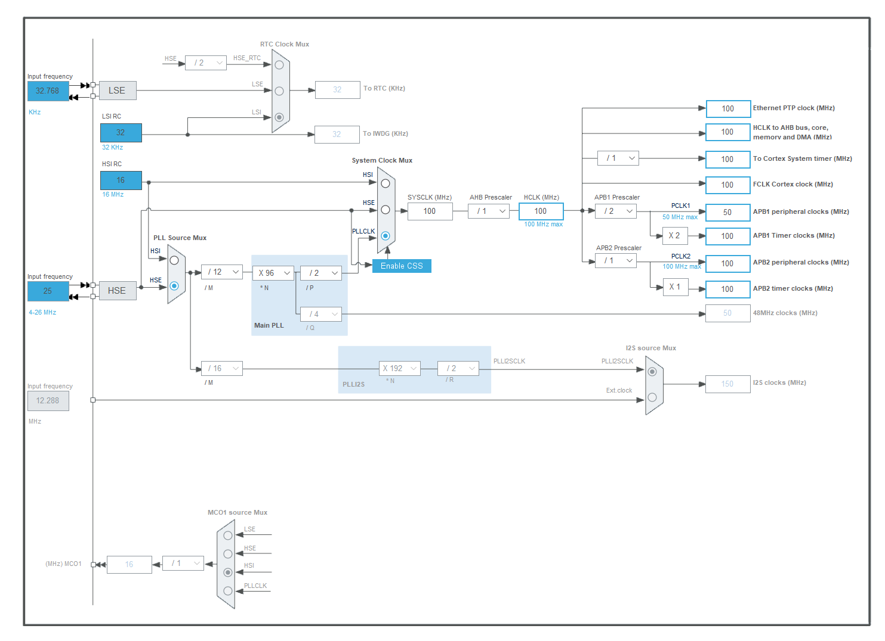

以F411CEU6为例

## 优化项

STM32 F4 系列具备指令缓存、数据缓存和预取缓冲区功能。

``` c
// 启用指令缓存、数据缓存、预取缓冲区
FLASH->ACR |= FLASH_ACR_ICEN | FLASH_ACR_DCEN | FLASH_ACR_PRFTEN;
```

- **`FLASH->ACR`**：`FLASH` 是一个指向闪存控制寄存器组的结构体指针，`ACR` 即闪存访问控制寄存器（Access Control Register）。借助对该寄存器进行操作，能够对闪存的访问行为进行配置。
- **`FLASH_ACR_ICEN`**：这是一个宏定义，代表指令缓存使能位。当该位被置为 1 时，指令缓存功能会被启用。指令缓存的作用是把频繁访问的指令存储起来，这样在后续需要执行这些指令时，就无需再从闪存中读取，从而加快指令的执行速度。
- **`FLASH_ACR_DCEN`**：这同样是一个宏定义，代表数据缓存使能位。当该位被置为 1 时，数据缓存功能会被启用。数据缓存用于存储频繁访问的数据，减少对闪存的访问次数，进而提高数据访问的速度。
- **`FLASH_ACR_PRFTEN`**：此宏定义代表预取缓冲区使能位。当该位被置为 1 时，预取缓冲区功能会被启用。预取缓冲区能够提前从闪存中读取指令，在 CPU 需要执行指令时可以更快地提供指令，从而提升指令的执行效率。

> 在 STM32 F1 系列中，只有大容量产品（如 STM32F103xE 等）具备预取缓冲区（Prefetch Buffer）功能，不过并没有指令缓存（Instruction Cache）和数据缓存（Data Cache）功能。

## 配置时钟源

以下图中时钟配置为例：



``` c
// 配置使用外部高速时钟 HSE 作为时钟源
void SystemClock_Config(void) {
	ErrorStatus HSEStartUpStatus;
	RCC_DeInit();	// 复位 RCC 时钟配置为默认值

	RCC_HSEConfig(RCC_HSE_ON);	// 使能 HSE
	HSEStartUpStatus = RCC_WaitForHSEStartUp();	// 等待 HSE 启动

	if (HSEStartUpStatus == SUCCESS) {
		// 配置 PLL 锁相环
		RCC_PLLConfig(RCC_PLLSource_HSE, 12, 96, 2, 4);
		// 使能 PLL 锁相环
		RCC_PLLCmd(ENABLE);
		
		while (RCC_GetFlagStatus(RCC_FLAG_PLLRDY) == RESET) {
			// 等待 PLL 启动
		}

		// 配置系统时钟
		RCC_HCLKConfig(RCC_SYSCLK_Div1);
		// 配置 APB1 和 APB2 时钟
		RCC_PCLK1Config(RCC_HCLK_Div2);
		RCC_PCLK2Config(RCC_HCLK_Div1);
		// 设置系统时钟
		RCC_SYSCLKConfig(RCC_SYSCLKSource_PLLCLK);

		// 等待系统时钟切换到 PLL
		while (RCC_GetSYSCLKSource() != 0x08) {}
	} else {
		while (1) {}
		// 配置失败，死循环
	}
}
```

配置完毕之后可以通过一个函数获取到当前芯片的系统时钟频率：

``` c
// 获取当前系统时钟频率
void get_clock_info(void) {
	RCC_ClocksTypeDef RccClocks;
	RCC_GetClocksFreq(&RccClocks);

	printf("SYSCLK Frequency: %lu Hz\r\n", RccClocks.SYSCLK_Frequency);
	printf("HCLK Frequency: %lu Hz\r\n", RccClocks.HCLK_Frequency);
	printf("PCLK1 Frequency: %lu Hz\r\n", RccClocks.PCLK1_Frequency);
	printf("PCLK2 Frequency: %lu Hz\r\n", RccClocks.PCLK2_Frequency);
}
```

## GPIO

``` 
// LED硬件GPIO初始化
void led_init() {
    RCC_AHB1PeriphClockCmd(RCC_AHB1Periph_GPIOC, ENABLE);

    GPIO_InitTypeDef blue_led_pin;
    blue_led_pin.GPIO_Pin = GPIO_Pin_13;
    blue_led_pin.GPIO_Mode = GPIO_Mode_OUT;
    blue_led_pin.GPIO_Speed = GPIO_Speed_2MHz;
    blue_led_pin.GPIO_OType = GPIO_OType_PP;
    blue_led_pin.GPIO_PuPd = GPIO_PuPd_NOPULL;
    
    GPIO_Init(GPIOC, &blue_led_pin);    
}
```


## UART/USART

使用串口，看芯片的引脚发现，UART1需要复用GPIOA的Pin9和Pin10。

所以总体流程是：

* 使能GPIO
* 使能UART
* 配置GPIO Pin脚属性及Pin复用（引脚复用这里要注意，F1系列中使用`GPIO_Init`函数就完成复用功能了，但是F4系列引脚复用功能更强大，所以要使用单独的`GPIO_PinAFConfig`函数指定复用功能）
* 配置Pin脚UART属性
* 使能UART接收中断
* 使能UART
* 配置UART接收中断的NVIC
* 重写UART接收中断服务程序

``` c
#include "stm32f4xx.h"
#include "usart.h"

// Reuse GPIOA Pin9 and Pin10 as UART1 TX/RX pins
void usart1_gpio_init(void) {
    
    RCC_AHB1PeriphClockCmd(RCC_AHB1Periph_GPIOA, ENABLE);   // enable GPIOA clock
    RCC_APB2PeriphClockCmd(RCC_APB2Periph_USART1, ENABLE);  // enable USART1 clock

    // initialize USART1 TX pin
    GPIO_InitTypeDef usart1_tx_pin;
    usart1_tx_pin.GPIO_Pin = GPIO_Pin_9;
    usart1_tx_pin.GPIO_Mode = GPIO_Mode_AF;
    usart1_tx_pin.GPIO_Speed = GPIO_Speed_50MHz;
    usart1_tx_pin.GPIO_OType = GPIO_OType_PP;
    usart1_tx_pin.GPIO_PuPd = GPIO_PuPd_UP;
    GPIO_Init(GPIOA, &usart1_tx_pin);

    // initialize USART1 RX pin
    GPIO_InitTypeDef usart1_rx_pin;
    usart1_rx_pin.GPIO_Pin = GPIO_Pin_10;
    usart1_rx_pin.GPIO_Mode = GPIO_Mode_AF;
    usart1_rx_pin.GPIO_Speed = GPIO_Speed_50MHz;
    usart1_rx_pin.GPIO_OType = GPIO_OType_OD;
    usart1_rx_pin.GPIO_PuPd = GPIO_PuPd_UP;
    GPIO_Init(GPIOA, &usart1_rx_pin);

    // REMAP USART1 TX/RX pins
    GPIO_PinAFConfig(GPIOA, GPIO_PinSource9, GPIO_AF_USART1);
    GPIO_PinAFConfig(GPIOA, GPIO_PinSource10, GPIO_AF_USART1);

    // initialize USART1
    USART_InitTypeDef usart1_init;
    usart1_init.USART_BaudRate = 115200;
    usart1_init.USART_WordLength = USART_WordLength_8b;
    usart1_init.USART_StopBits = USART_StopBits_1;
    usart1_init.USART_Parity = USART_Parity_No;
    usart1_init.USART_HardwareFlowControl = USART_HardwareFlowControl_None;
    usart1_init.USART_Mode = USART_Mode_Rx | USART_Mode_Tx;
    USART_Init(USART1, &usart1_init);

    // enable USART1 RX interrupt
    USART_ITConfig(USART1, USART_IT_RXNE, ENABLE);
    // enable USART1
    USART_Cmd(USART1, ENABLE);

    // enable USART1 interrupt
    NVIC_InitTypeDef nvic_init;
    nvic_init.NVIC_IRQChannel = USART1_IRQn;
    nvic_init.NVIC_IRQChannelPreemptionPriority = 6;
    nvic_init.NVIC_IRQChannelSubPriority = 0;
    nvic_init.NVIC_IRQChannelCmd = ENABLE;
    NVIC_Init(&nvic_init);
}

// USART1中断服务程序
// USART1 interrupt service program
void USART1_IRQHandler(void) {
    if (USART_GetITStatus(USART1, USART_IT_RXNE) != RESET) {
        char ch = USART_ReceiveData(USART1);
        USART_SendData(USART1, ch);
        USART_ClearITPendingBit(USART1, USART_IT_RXNE);
    }
}
```


