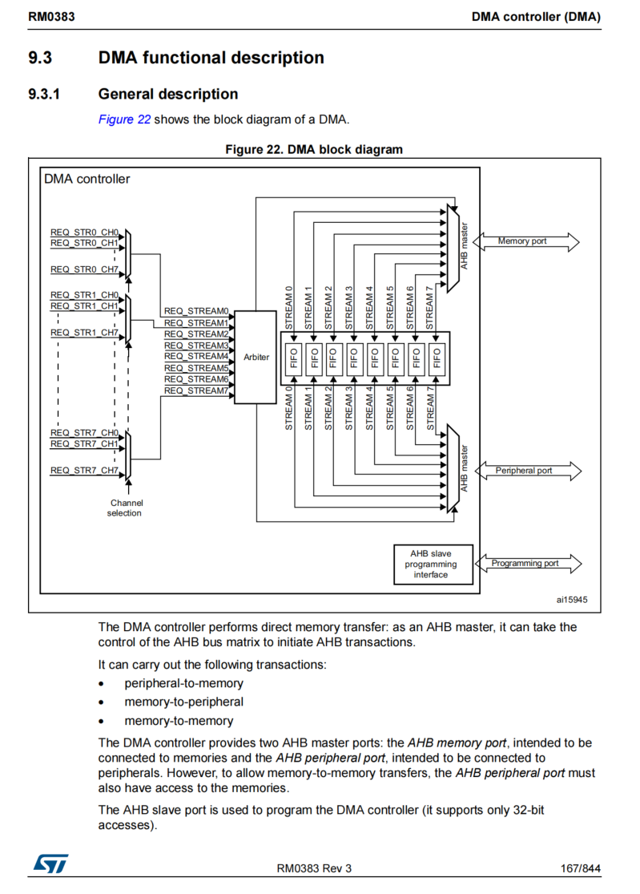
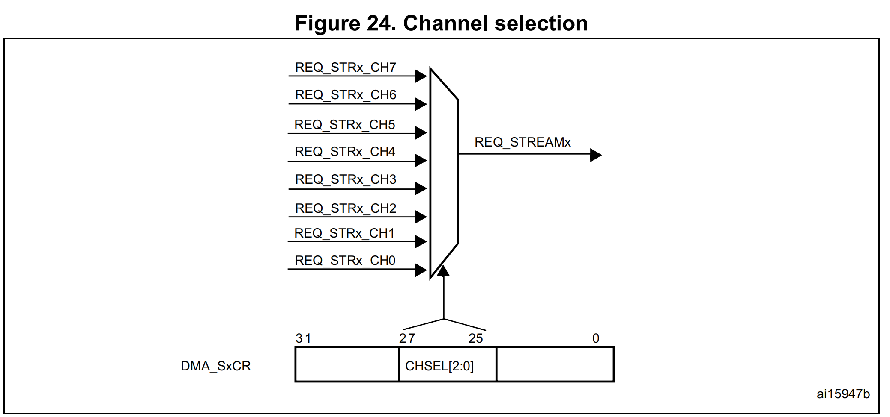
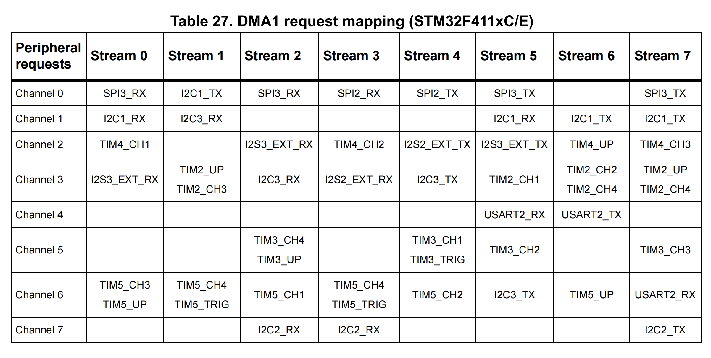

## DMA

1. DMA控制器在MCU内部是一个AMBA advcanced high-performance bus (AHB) Master。
2. DMA控制器和AHB有三个接口：
   1. 一个Slave接口（用于CPU对它进行编程）
   2. 两个Master接口，允许将DMA去开启两个AHB总线上两个从设备之间的信号通信。
3. 每个DMA都具有8个Streams
   1. 每个Stream都只能单向传输
   2. Steam可被配置的模式
      1. 从内存到外设
      2. 从外设到内存
      3. 从内存到内存

## FIFO

FIFO可以作为一个临时缓存区，将数据暂时存储在队列中，以减少对内存或外设的频繁访问，提高系统的效率。

以DMA搬运串口接收到的数据为例，每来一个字节都要搬运一次，此时就会DMA占用从AHB总线到memory的总线，此时CPU就不能访问memory，或者CPU正在访问memory那么DMA就暂时不能将数据搬运过去，这样效率比较低。

**FIFO的作用：**

1，减少AHB带宽的占用，减少AHB总线的仲裁，让CPU能够在AHB总线上占用更大的带宽而不需要和DMA经常竞争总线。（DMA接收数据时可以旁路AHB总线）

2，减少溢出，在需要动态扩展内存时，DMA会暂存数据进入FIFO，给CPU执行动态扩展内存争取时间，防止溢出。

3、DMA多路Stream仲裁时，FIFO可以多路Stream缓冲，极大提高并发性。

**单位**
       由8个位bit组成1个字节Byte；在一台8位机中，它的一个字就是一字节，一台16位机，它的一个字就是两字节，同理32位机一个字是4个字节；半字就是字的一半。

**FIFO**
      每个数据流都独立拥有四级32位FIFO(先进先出存储器缓冲区)。FIFO的阈值， 分别为1/4、1/2、3/4和满，即分别为32位，64位，96位和128位。如果数据存储量达到阈值级别时，FIFO内容将传输到目标中。

  PBURST[1:0]和MBURST[1:0]位是位于DMA_SxCR寄存器中的，用于分别设置外设和存储器不同节拍数的突发传输， 对应为单次传输、4个节拍增量传输、8个节拍增量传输和16个节拍增量传输。节拍取决于MSIZE或PSIZE。

参考资料：

1.[CSDN](https://blog.csdn.net/tang0201/article/details/140506796#:~:text=%E7%94%B18%E4%B8%AA%E4%BD%8Dbit%E7%BB%84%E6%88%901%E4%B8%AA%E5%AD%97%E8%8A%82Byte%EF%BC%9B%E5%9C%A8%E4%B8%80%E5%8F%B08%E4%BD%8D%E6%9C%BA%E4%B8%AD%EF%BC%8C%E5%AE%83%E7%9A%84%E4%B8%80%E4%B8%AA%E5%AD%97%E5%B0%B1%E6%98%AF%E4%B8%80%E5%AD%97%E8%8A%82%EF%BC%8C%E4%B8%80%E5%8F%B016%E4%BD%8D%E6%9C%BA%EF%BC%8C%E5%AE%83%E7%9A%84%E4%B8%80%E4%B8%AA%E5%AD%97%E5%B0%B1%E6%98%AF%E4%B8%A4%E5%AD%97%E8%8A%82%EF%BC%8C%20%E5%90%8C%E7%90%8632%E4%BD%8D%E6%9C%BA%E4%B8%80%E4%B8%AA%E5%AD%97%E6%98%AF4%E4%B8%AA%E5%AD%97%E8%8A%82%EF%BC%9B%E5%8D%8A%E5%AD%97%E5%B0%B1%E6%98%AF%E5%AD%97%E7%9A%84%E4%B8%80%E5%8D%8A%E3%80%82%20%E6%AF%8F%E4%B8%AA%E6%95%B0%E6%8D%AE%E6%B5%81%E9%83%BD%E7%8B%AC%E7%AB%8B%E6%8B%A5%E6%9C%89%20%E5%9B%9B%E7%BA%A732%E4%BD%8D%20FIFO,%28%E5%85%88%E8%BF%9B%E5%85%88%E5%87%BA%E5%AD%98%E5%82%A8%E5%99%A8%E7%BC%93%E5%86%B2%E5%8C%BA%29%E3%80%82%20FIFO%E7%9A%84%E9%98%88%E5%80%BC%EF%BC%8C%20%E5%88%86%E5%88%AB%E4%B8%BA1%2F4%E3%80%811%2F2%E3%80%813%2F4%E5%92%8C%E6%BB%A1%EF%BC%8C%20%E5%8D%B3%E5%88%86%E5%88%AB%E4%B8%BA32%E4%BD%8D%EF%BC%8C64%E4%BD%8D%EF%BC%8C96%E4%BD%8D%E5%92%8C128%E4%BD%8D%E3%80%82%20%E5%A6%82%E6%9E%9C%E6%95%B0%E6%8D%AE%E5%AD%98%E5%82%A8%E9%87%8F%E8%BE%BE%E5%88%B0%E9%98%88%E5%80%BC%E7%BA%A7%E5%88%AB%E6%97%B6%EF%BC%8CFIFO%E5%86%85%E5%AE%B9%E5%B0%86%E4%BC%A0%E8%BE%93%E5%88%B0%E7%9B%AE%E6%A0%87%E4%B8%AD%E3%80%82)

## burst

Burst介绍：

DMA控制器可以生成单次传输或增量突发传输，传输的节拍数为4、8或16。

为了确保数据一致性，构成突发传输的每组传输都是不可分割的：AHB传输被锁定，AHB总线矩阵的仲裁器在突发传输序列期间不会撤销DMA主设备的授权。

作用：

可以通过Brust进行多个寄存器的同时修改，在M2P时同时配置多个定时器

https://shequ.stmicroelectronics.cn/thread-638925-1-1.html

## 仲裁机制

当同时使用多个stream流时，首先根据初始化时设定的优先级进行排序（软件），优先级高的先执行，如果优先级相同，那么根据stream*，即stream流本身的数字大小，小的先执行，比如stream1和stream2为相同优先级，那么stream1先运行。

