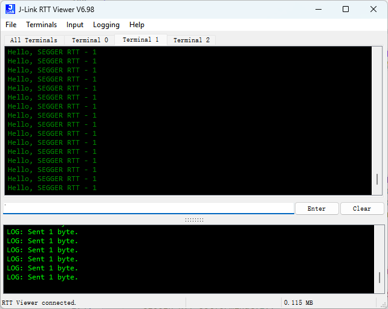

## RTT实现机制


* RTT支持多个上下行通道，每个通道都独立管理自己的缓冲区和读写指针，即可以用于不同的任务

* 配置文件`SEGGER_RTT_Conf.h`中有对上下行缓冲区大小的配置选项

``` c
#ifndef   BUFFER_SIZE_UP
  #define BUFFER_SIZE_UP                            (1024)  // Size of the buffer for terminal output of target, up to host (Default: 1k)
#endif

#ifndef   BUFFER_SIZE_DOWN
  #define BUFFER_SIZE_DOWN                          (16)    // Size of the buffer for terminal input to target from host (Usually keyboard input) (Default: 16)
#endif
```

官方推荐的缓冲区大小设置：


## RTT使用方法

1. 需要先将相关的文件加入工程中，包括：

   在工程中**包含这里头文件的路径**，然后将`SEGGER_RTT.c\SEGGER_RTT_Conf.h\SEGGER_RTT_printf.c`加入到工程中

2. 包含头文件`#include "SEGGER_RTT.h"`

3. 包含微库`MicroLIB`，然后重定向输出

``` 
// 定义PUTCHAR_PROTOTYPE
#ifdef __GNUC__
    #define PUTCHAR_PROTOTYPE int _io_putchar(int ch)
#else
    #define PUTCHAR_PROTOTYPE int fputc(int ch, FILE *f)
#endif /* __GNUC__*/
// 重定向printf函数到USART1
PUTCHAR_PROTOTYPE
{
    // 等待发送缓冲区为空
    while (USART_GetFlagStatus(USART1, USART_FLAG_TXE) == RESET);
    // 发送字符
    USART_SendData(USART1, (uint8_t)ch);
    return ch;
}
```

4. 使用输出函数即可

## RTT输出浮点数

因为RTT中的输出函数（为了轻量化）不支持浮点数输出，为了实现浮点数输出功能，就需要将`printf`重定向到RTT的输出中。

### 方法一：修改RTT源码

当然也可以通过修改RTT源码的方法实现浮点数输出功能，但是这样比较麻烦，修改的部分如下，在`SEGGER_RTT_printf.c`文件中添加以下代码：

``` c
  case 'f':
    case 'F':
      float fv = (float)va_arg(*pParamList, double);
      if (fv < 0) {
        _StoreChar(&BufferDesc, '-');
      }

      v = abs((int) fv);
      _PrintInt(&BufferDesc, v, 10u, NumDigits, FieldWidth, FormatFlags);
      _StoreChar(&BufferDesc, '.');
      v = abs((int) (fv * 100));
      v = v % 100;
      _PrintInt(&BufferDesc, v, 10u, NumDigits, FieldWidth, FormatFlags);
      break;
```


效果测试：

``` c
int main() {
	while (1) {
		SEGGER_RTT_printf(0, RTT_CTRL_TEXT_BLUE"Hello, SEGGER RTT - 2 %f\t\n", 1.10);
		//printf("SEGGER RTT Test\r\n");
		delay_ms(1000);
	}
}
```

输出：


### 方法二：重定向printf函数

1. 配置RTT相关环境，包含微库`MicroLIB`
2. 重定向输出：

``` 
// 定义PUTCHAR_PROTOTYPE
#ifdef __GNUC__
    #define PUTCHAR_PROTOTYPE int _io_putchar(int ch)
#else
    #define PUTCHAR_PROTOTYPE int fputc(int ch, FILE *f)
#endif /* __GNUC__*/
// 重定向printf函数到USART1
PUTCHAR_PROTOTYPE
{
    // 等待发送缓冲区为空
    while (USART_GetFlagStatus(USART1, USART_FLAG_TXE) == RESET);
    // 发送字符
    // USART_SendData(USART1, (uint8_t)ch);
	
	SEGGER_RTT_SetTerminal(0);
	SEGGER_RTT_PutChar(0, ch);	// 输出到0号终端
    
    return ch;
}
```

3. 这样就将`printf()`函数的输出重定向到了RTT中，可以通过RTT进行接收了

``` 
int main() {
	while (1) {
		// SEGGER_RTT_SetTerminal(0);
		// SEGGER_RTT_printf(0, RTT_CTRL_TEXT_RED"Hello, SEGGER RTT - 0\t\n");
		// SEGGER_RTT_SetTerminal(1);
		// SEGGER_RTT_printf(0, RTT_CTRL_TEXT_GREEN"Hello, SEGGER RTT - 1\t\n");
		// SEGGER_RTT_SetTerminal(2);
		// SEGGER_RTT_printf(0, RTT_CTRL_TEXT_BLUE"Hello, SEGGER RTT - 2\t\n");
		printf("SEGGER RTT Test\r\n");
		delay_ms(1000);
	}
}
```


## RTT输出格式

### 改变颜色

在输出函数中可以指定当前语句的颜色，但是要注意格式，颜色和输出语句之间是相连的。

``` 
int main() {
	while (1) {
		SEGGER_RTT_SetTerminal(0);
		SEGGER_RTT_printf(0, RTT_CTRL_TEXT_RED"Hello, SEGGER RTT - 0\t\n");
		SEGGER_RTT_SetTerminal(1);
		SEGGER_RTT_printf(0, RTT_CTRL_TEXT_GREEN"Hello, SEGGER RTT - 1\t\n");
		SEGGER_RTT_SetTerminal(2);
		SEGGER_RTT_printf(0, RTT_CTRL_TEXT_BLUE"Hello, SEGGER RTT - 2\t\n");
		delay_ms(1000);
	}
}
```

### 指定通道

通过`SEGGER_RTT_SetTerminal()`函数可以指定输出通道

``` 
int main() {
	while (1) {
		SEGGER_RTT_SetTerminal(0);	// 指定通道0
		SEGGER_RTT_printf(0, "Hello, SEGGER RTT - 0\t\n");
		SEGGER_RTT_SetTerminal(1);	// 指定通道1
		SEGGER_RTT_printf(0, "Hello, SEGGER RTT - 1\t\n");
		SEGGER_RTT_SetTerminal(2);	// 指定通道2
		SEGGER_RTT_printf(0, "Hello, SEGGER RTT - 2\t\n");
		delay_ms(1000);
	}
}
```

相应的在接收端也分为很多个通道

所有通道：


各自分通道，消息只会出现在总通道和你指定的通道中：





## RTT配合EasyLogger日志模块

### easylogger的移植

官方库：[github库](https://github.com/armink/EasyLogger)

下载后文件夹中共有一下几个目录：


主要文件在easylogger文件夹中：其中inc为头文件，src中为.c源文件，plugins是插件


移植所需的文件：

* `inc/elog_cfg.h`
* `port/elog_port.c`
* `src/elog.c、src/elog_async.c、src/elog_buf.c、src/elog_utils.c`

在工程中导入以上源文件后，首先要完成printf的重定向(为了输出到串口)，然后需要修改以下文件中的代码：

``` c
// elog_port.c

/**
 * output log port interface
 *
 * @param log output of log
 * @param size log size
 */
void elog_port_output(const char *log, size_t size) {
    
    /* add your code here */
    // printf("%.*s", size, log);	// 重定向至串口输出
	SEGGER_RTT_Write(0, log, size);	// 输出至RTT
}
```

如果不使用异步输出，编译可能会有报错，需要注释掉以下两个宏定义：

``` c
// elog_cfg.h

// #define ELOG_ASYNC_OUTPUT_ENABLE
// #define ELOG_BUF_OUTPUT_ENABLE
```

### 使用方法

使用EasyLogger之前需要初始化：

``` c
void app_lod_init() {
	// 初始化日志系统
	elog_init();
	
	// 输出颜色使能
	elog_set_text_color_enabled(true);
	
	// 配置各log级别的输出格式
	elog_set_fmt(ELOG_LVL_ASSERT, ELOG_FMT_TIME | ELOG_FMT_LVL | ELOG_FMT_TAG | ELOG_FMT_DIR | ELOG_FMT_LINE | ELOG_FMT_FUNC);
	elog_set_fmt(ELOG_LVL_DEBUG, ELOG_FMT_TIME | ELOG_FMT_LVL | ELOG_FMT_TAG | ELOG_FMT_DIR | ELOG_FMT_LINE | ELOG_FMT_FUNC);
	elog_set_fmt(ELOG_LVL_ERROR, ELOG_FMT_TIME | ELOG_FMT_LVL | ELOG_FMT_TAG | ELOG_FMT_DIR | ELOG_FMT_LINE | ELOG_FMT_FUNC);
	elog_set_fmt(ELOG_LVL_INFO, ELOG_FMT_TIME | ELOG_FMT_LVL | ELOG_FMT_TAG | ELOG_FMT_DIR | ELOG_FMT_LINE | ELOG_FMT_FUNC);
	elog_set_fmt(ELOG_LVL_WARN, ELOG_FMT_TIME | ELOG_FMT_LVL | ELOG_FMT_TAG | ELOG_FMT_DIR | ELOG_FMT_LINE | ELOG_FMT_FUNC);
	
	// 启动日志系统
	elog_start();
}
```

`TAG`的使用方法：

``` c
#define TAG "MAIN"
void test_log(void) {
	elog_a(TAG, "Hello EasyLogger!");
	elog_e(TAG, "Hello EasyLogger!");
	elog_w(TAG, "Hello EasyLogger!");
	elog_i(TAG, "Hello EasyLogger!");
	elog_d(TAG, "Hello EasyLogger!");
	elog_v(TAG, "Hello EasyLogger!");
}
```

**测试：**

``` c
int main() {
	#if 1
		app_lod_init();
		
	#endif

	while (1) {
		test_log();
		delay_ms(5000);
	}
}
```

输出结果：


发现可以正常通过RTT进行输出，但是还有些问题：`WARNING: <Terminal 0>: ANSI CSI SGR parameter 22 not supported.`

这是由于上位机不支持22这个ansi csi sgr参数，我们直接在文件中改成一个上位机支持的参数就可以了：

``` c
// elog.c

// #define S_NORMAL                       "22m"
#define S_NORMAL                       "2m"
```

此时，上位机软件中不会再报警告：

